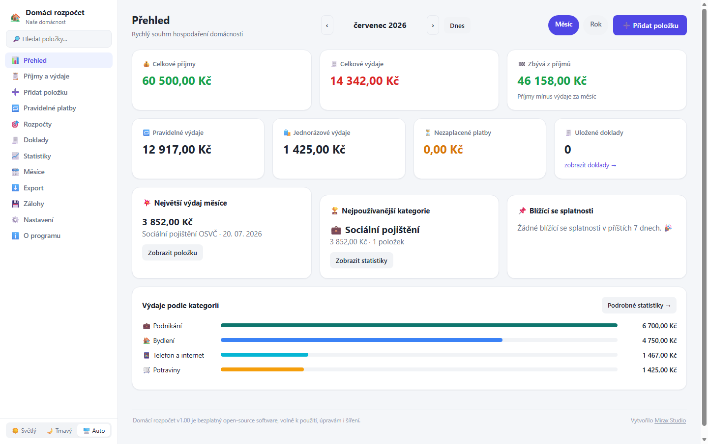

# 🏡 Domácí rozpočet

**Jednoduchá, česká a úplně zdarma aplikace pro správu rodinného rozpočtu.**
Běží celá lokálně na vašem počítači — bez instalace, bez internetu, bez registrace.


-16a34a)


Vytvořilo [Mirax Studio®](https://www.miraxstudio.cz) · více o vzniku aplikace v sekci [O programu](#-proč-tahle-aplikace-vznikla) níže.

> **🔒 Vaše data zůstávají u vás.** Aktuální verze aplikace neodesílá rozpočet,
> doklady, zálohy, exporty ani telemetrii autorovi nebo třetím stranám. Běží jen
> lokálně na `127.0.0.1`; technický popis a ověřitelné odkazy do kódu jsou v
> dokumentu [Tok dat a lokální provoz](DATA_FLOW.md).



---

## 🆕 Verze a novinky

Přehled změn v jednotlivých vydáních. Novou verzi vždy přidáváme nahoru,
aby bylo hned vidět, co se v aplikaci změnilo.

### v1.01 — 28. července 2026

**Vizuální vylepšení**

- Kompletně přepracovaný **Přehled**: přehlednější karty, graf vývoje příjmů
  a výdajů, koláčový graf kategorií a možnost zobrazené prvky zapínat či vypínat.
- Sjednocený moderní vzhled panelů napříč aplikací, opravené zarovnání karet,
  mezery a ovládací prvky včetně tmavého režimu.
- Lepší ovládání na mobilu a tabletu: responzivní rozložení a sbalitelné levé menu.
- Přehlednější navigace po měsících, kompaktnější ovládání a možnost exportu za
  vybraný měsíc i celý rok.
- Bezpečnější distribuce: zdrojový kód je oddělen od přenosného balíčku pro
  Windows, který je dostupný v GitHub Releases spolu s ověřovacím SHA-256 součtem.

### v1.00 — 28. července 2026

**První veřejné vydání**

- Lokální správa příjmů, výdajů, kategorií, rozpočtů a pravidelných plateb.
- Doklady, statistiky, měsíční přehledy, exporty a zálohy.
- Data domácnosti zůstávají na počítači uživatele; aplikace běží lokálně bez
  registrace, cloudu a telemetrie.

---

## 🚀 Stažení pro běžné použití (bez instalace)

Fakt to zvládne úplně každý:

1. Otevřete [GitHub Releases](https://github.com/miraxstudio-del/domaci-rozpocet/releases).
2. **Stáhněte** soubor `Domaci-rozpocet-vX.YY-windows-x64.zip` z nejnovějšího vydání.
3. **Rozbalte** stažený ZIP soubor kamkoliv na disk (např. na Plochu nebo do
   `Dokumenty`).
4. Přesuňte celou rozbalenou složku tam, kde ji chcete mít trvale uloženou
   (klidně na USB disk, do cloudu apod. — je to jedno).
5. Ve složce **dvakrát klikněte na `START.bat`**.
6. Aplikace se sama spustí a otevře v prohlížeči. Hotovo! 🎉

Nic dalšího se instalovat nemusí — oficiální release balíček si sebou nese
vlastní přenosný PHP server, takže funguje i na počítači, kde nikdy nic
podobného nebylo.

> `Code` → `Download ZIP` je určené pro vývojáře: obsahuje pouze zdrojový kód,
> nikoli přibalený PHP runtime. Pro běžné spuštění vždy použijte balíček z Releases.

**Všechno, co si v aplikaci vytvoříte a uložíte** (položky, kategorie, doklady,
nastavení), **zůstává jen a pouze na vašem počítači**, přímo ve složce
aplikace (`data/` a `uploads/`). Nic se nikam neposílá na internet.

Pro ukončení aplikace spusťte `STOP.bat`. Podrobný návod (kde jsou data, jak
zálohovat, jak aplikaci přenést na jiný počítač...) najdete v souboru
[`README.txt`](README.txt) přímo ve složce aplikace.

---

## ✨ Co aplikace umí

### 📊 Přehled a dashboard
- Souhrn aktuálního měsíce i **celého roku** jedním kliknutím — příjmy, výdaje,
  zůstatek, pravidelné vs. jednorázové výdaje, nezaplacené platby
- Porovnání s předchozím obdobím, největší výdaj, nejpoužívanější kategorie
- Upozornění na blížící se splatnosti

### 💰 Příjmy a výdaje
- Evidence libovolného počtu položek s částkou, datem, kategorií, způsobem
  platby, stavem (zaplaceno / čeká / po splatnosti / částečně / zrušeno)
- Podpora záporných/opravných částek, vrácení peněz, převodů mezi účty
- Kopírování položek, tvorba položky z pravidelné platby jedním klikem
- Podnikatelské vs. soukromé výdaje (volitelně)
- Poznámky, štítky, čísla dokladů

### 🏷️ Kategorie
- Desítky předpřipravených českých kategorií a podkategorií (potraviny,
  bydlení, doprava, zdraví, podnikání, volný čas...)
- Vlastní kategorie, ikony, barvy a měsíční limity

### 🔁 Pravidelné platby
- Nájem, energie, pojištění, předplatné a další opakované platby
- Týdenní/měsíční/čtvrtletní/roční frekvence, automatické vytváření položek
  v novém měsíci, upozornění před splatností

### 🎯 Rozpočty
- Celkový měsíční rozpočet i limity pro jednotlivé kategorie
- Plánované příjmy, minimální zůstatek, finanční rezerva
- Přehledné ukazatele čerpání

### 🧾 Doklady a přílohy
- Nahrávání účtenek, faktur, smluv (PDF, JPG, PNG, WEBP a další)
- Náhled, stažení, vyhledávání dokladů podle data, částky, kategorie

### 📈 Statistiky
- Vlastní přehledné grafy (bez nutnosti internetu) — výdaje podle kategorií,
  vývoj v čase, způsoby platby, poměr příjmů a výdajů a další
- Přepínání mezi pohledem za **měsíc** i za **celý rok**
- Kliknutím na graf zobrazíte konkrétní položky

### 🗓️ Měsíce
- Podrobný přehled a uzavírání jednotlivých měsíců (vratné), porovnání dvou
  měsíců, tisk / export přehledu

### ⬇️ Export a 💾 zálohy
- Export do CSV, Excelu (XLSX) i tisku/PDF, se správnou českou diakritikou
- Automatická denní záloha + ruční záloha jedním tlačítkem
- Bezpečná obnova ze zálohy (i ze zálohy přenesené z jiného počítače)

---

## 🔒 Soukromí a bezpečnost

- Lokální server naslouchá **pouze na `127.0.0.1`** — není dostupný z
  internetu ani z jiných zařízení ve vaší síti
- Žádná telemetrie, žádné reklamy, žádná registrace ani cloud
- Databáze je obyčejný SQLite soubor, který máte plně pod kontrolou

Podrobnosti pro aktuální způsob fungování najdete v
[zásadách soukromí](PRIVACY.md), [toku dat](DATA_FLOW.md) a
[bezpečnostních zásadách](SECURITY.md).

## 🛠️ Použité technologie

Čisté PHP 8.2 (bez frameworku) + SQLite, vlastní JS grafy nad `<canvas>`.
Přenosný PHP běhový program pro Windows je přibalený pouze v oficiálním
balíčku z GitHub Releases — cílový počítač nepotřebuje mít nic předinstalované.

## 📁 Struktura projektu

```
DomaciRozpocet/
├── START.bat / STOP.bat   – spuštění a ukončení aplikace
├── README.txt             – podrobný český návod k použití
├── app/                   – zdrojový kód aplikace
├── data/                  – databáze a zálohy (nesdílí se do gitu)
├── uploads/                – nahrané doklady
└── exporty/                – vygenerované exporty
```

Vývojářský postup pro přípravu přenosného vydání je v
[dokumentaci k vydávání](docs/RELEASING.md).

## 📜 Licence

Tento projekt je **open-source** a je možné jej volně používat, upravovat i
dále šířit — viz soubor [`LICENSE`](LICENSE) (MIT).

Přečtěte si také [omezení odpovědnosti](DISCLAIMER.md). Licence MIT zůstává
hlavním právním textem projektu; doplňující dokumenty ji nenahrazují.
Použití názvu a loga upravuje [oznámení o ochranné známce](TRADEMARKS.md).

## 🙋 O původu aplikace

Aplikace vznikla proto, že manželka chtěla mít konečně pořádný přehled o
rodinném rozpočtu — a excelová tabulka to už dál neutáhla. Víc o tom (a proč
je to vlastně vtipný příběh) najdete přímo v aplikaci v sekci **O programu**.

---

<div align="center">

Vytvořilo ❤️ **[Mirax Studio®](https://www.miraxstudio.cz)**

</div>
